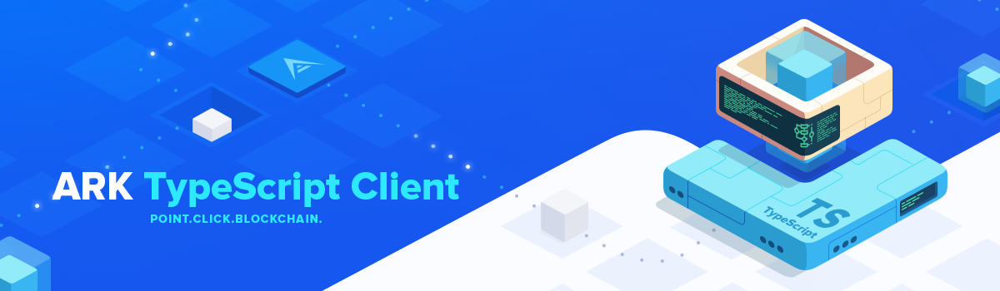

# Blockpool - Client

<p align="center">
    
</p>

> Lead Maintainer: [Brian Faust](https://github.com/faustbrian)

## Installation

```bash
yarn add @blockpool-io/client
```

## Usage

```ts
import { Connection } from "@arkecosystem/client";

const init = async () => {
	const connection: Connection = new Connection("https://dexplorer.ark.io/api/v2");

	console.log(await connection.api("blocks").all())
};

init();
```

See [tests](https://github.com/ArkEcosystem/javascript-client/tree/master/__tests__/resources) for more examples.

## Security

If you discover a security vulnerability within this package, please send an e-mail to support@blockpool.io. All security vulnerabilities will be promptly addressed.

## Credits

This project exists thanks to all the people who [contribute](../../contributors).

## License

[MIT](LICENSE) © [Blockpool](https://blockpool.io)
[MIT](LICENSE) © [ArkEcosystem](https://ark.io)
